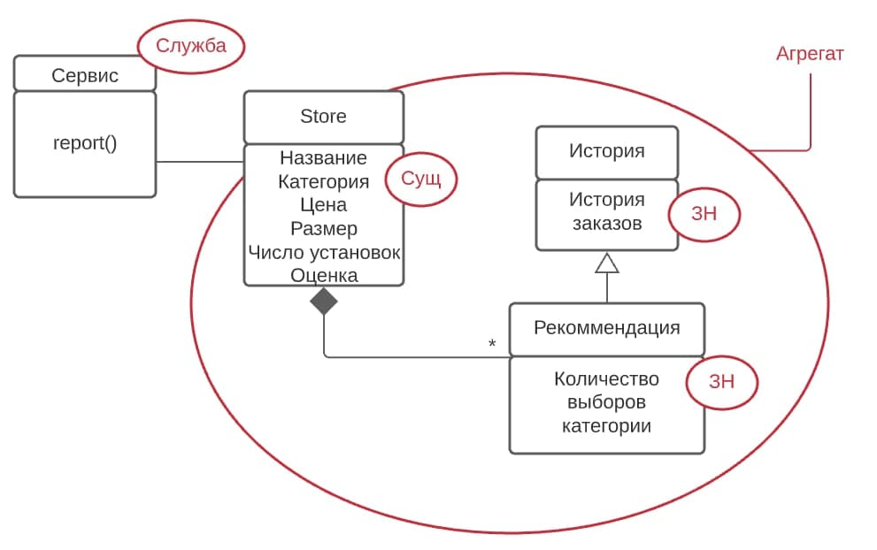

## Описание задания

"Магазин приложений".

На основании подготовленного пользователем заказа, а также истории выполненных им заказов необходимо подготовить перечень рекомендаций для дополнительных товаров «Вам также может понравиться это: …».

## Диаграмма классов агрегата Store

Диаграмма классов агрегата Store:

